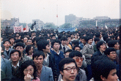

	

	
On April 22nd, university students from Xi'an marched to the city center to mourn former Party Secretary and liberal reformer Hu Yao Bang.

	
Some individuals lit a couple of trucks on fire and looted nearby stores.  Officials called it the Xi'an riots.

	

	

		<figure>
			
			<figcaption id="imgCaption">Students in City Square</figcaption>
		</figure>	
		<figure>
			
			<figcaption id="imgCaption">Students sitting in City Square</figcaption>
		</figure>
		<figure>
			
			<figcaption id="imgCaption">Police perimiter at Provincial Government Building</figcaption>
		</figure>
		<figure>
			
			<figcaption id="imgCaption">Smoke from burning truck</figcaption>
		</figure>
	<!--
		

			
			
			
			
			
		

		

			

			
Students in City Square

		

	

	-->

